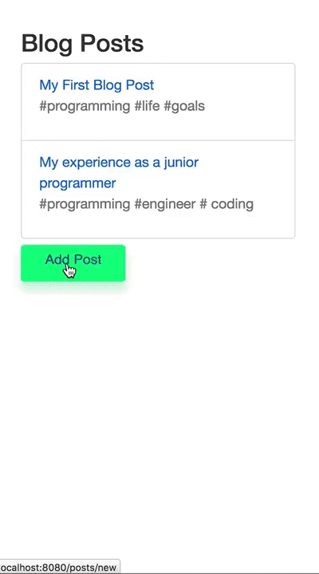

# Blog App
- Build while following the course [React-Redux](https://www.udemy.com/react-redux/).
- Project is build on [this boilerplate](https://github.com/StephenGrider/ReduxSimpleStarter).
- App makes use of the by the course provided API to store data on the server.
- Aim of this project was to get a basic understanding of React and Redux.
- Little effort has been put into styling, as this was not the main goal.
- Notes in relation to components can be found in my [React component cheatsheet folder](https://github.com/silksil/best-practices-cheatsheets/tree/master/client/react/example-components).

### Visual Representation App


#### Try it yourself ?
Clone or download and:
```
> npm install
> npm start
```
